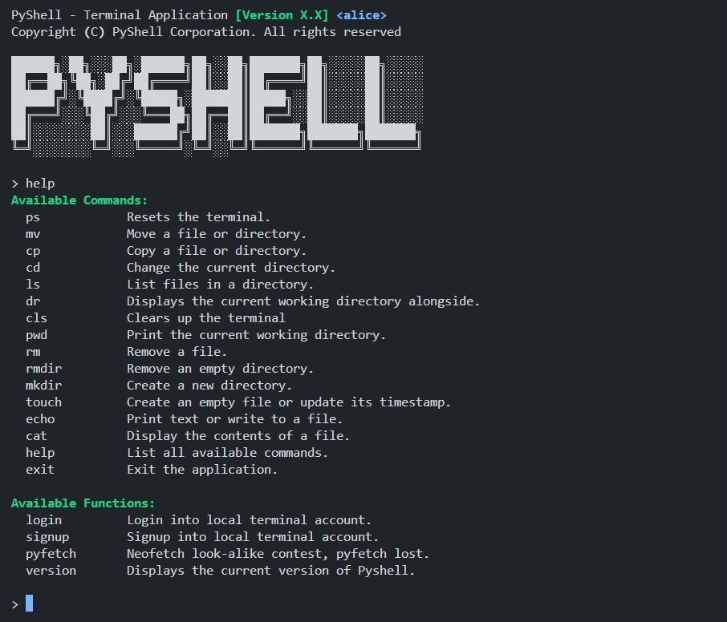

# PyShell

## Overview
PyShell is a lightweight and customizable Python-based shell application. It emulates basic shell functionality and includes additional features like hardware information retrieval (inspired by Neofetch), file management, and user account management.



## Features
- **Basic Shell Commands**:
  - `mv`, `cp`, `cd`, `ls`, `pwd`, `rm`, `rmdir`, `mkdir`, `touch`, `echo`, and `cat`.
- **User Account Management**:
  - `signup` and `login` commands for local account handling.
  - Passwords are securely hashed using bcrypt.
- **Hardware Information**:
  - Displays CPU, GPU, OS, Kernel, uptime, memory, and resolution details.
- **Extensibility**:
  - Modular design allows easy addition of new commands.

## Project Structure
```
pyshell/
├── pyshell/
│   ├── pyshell.py         # Main application entry point
│   └── __init__.py        # Marks package
├── assets/
│   ├── pyshell.png        # Overview pyshell image
├── shared/
│   ├── utils.py           # Utility commands module
│   ├── pyfetch.py         # System information module
│   ├── cputils.py         # Modified cpuinfo module
│   └── __init__.py        # Marks package
├── README             # README file
├── LICENSE            # LICENSE file
└── .gitignore         # Git ignore file
```

## Installation
1. Clone the repository:
   ```bash
   git clone https://github.com/Xar-Me-Ison/pyshell.git
   cd pyshell
   ```

2. Create a virtual environment:
   ```bash
   python -m venv venv
   source venv/bin/activate   # On Windows: venv\Scripts\activate
   ```

3. Install dependencies:
   ```bash
   pip install -r requirements.txt
   ```

4. Run PyShell:
   ```bash
   python -m pyshell.pyshell
   ```

## Usage
### Example Commands
- **File Operations**:
  ```
  > mkdir test_dir
  > touch test_file.txt
  > mv test_file.txt test_dir/
  ```
- **User Management**:
  ```
  > signup
  Username: alice
  Password: ••••••
  Retype password: ••••••
  <> 'bob' has been created successfully

  > login
  Enter username: alice
  Enter password: ••••••
  ```
- **System Information**:
  ```
  > pyfetch
  ┏━━━━━━━━━━━━┳━━━━━━━━━━━━━━━━━━━━━━━━━━━━━━━━━━━━━━━━━━━━━━━┓
  ┃ pyfetch    ┃ System Information                            ┃
  ┡━━━━━━━━━━━━╇━━━━━━━━━━━━━━━━━━━━━━━━━━━━━━━━━━━━━━━━━━━━━━━┩             
  │ OS         │ Windows 11 (Version: 10.0.26100)              │
  │ Host       │ SN1987A-S                                     │
  │ Kernel     │ Windows NT kernel                             │
  │ Uptime     │ 5:37:04                                       │
  │ Shell      │ pyshell                                       │
  │ Resolution │ 1920x1080                                     │
  ├────────────┼───────────────────────────────────────────────┤
  │ CPU        │ AMD Ryzen 5 5600X 6-Core Processor (6C / 12T) │
  │ GPU        │ NVIDIA GeForce RTX 3060 (VRAM: 12288MB)       │
  │ Memory     │ 13365MB / 32694MB                             │
  └────────────┴───────────────────────────────────────────────┘
  ```

## Contributing
1. Fork the repository.
2. Create a feature branch:
   ```bash
   git checkout -b feature-name
   ```
3. Commit your changes:
   ```bash
   git commit -m "Add a feature"
   ```
4. Push to the branch:
   ```bash
   git push origin feature-name
   ```
5. Open a Pull Request.

## License
This project is licensed under the Apache-2.0 License. See the `LICENSE` file for details.

## Acknowledgments
- Inspired by Unix shells and tools like Neofetch.
- Utilizes libraries such as `rich`, `psutil`, and `bcrypt` for enhanced functionality.

